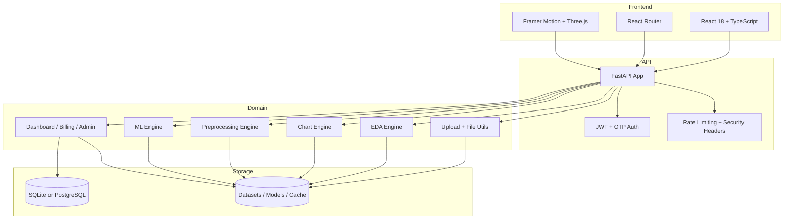

<div align="center">

  
  
  
  

  # 📊 Dataset Analyzer

  ### Full-Stack Data Analysis Platform

  **Upload datasets, profile columns, generate charts, preprocess data, and train ML models in one workspace.**

  EDA • Visualization • Preprocessing • ML Builder • Dashboard • Billing • Admin

  [🚀 Quick Start](#-quick-start) · [✨ Features](#-features) · [🏗️ Architecture](#-architecture) · [📡 API Surface](#-api-surface)

</div>

---

## 🎯 Overview

Dataset Analyzer is a full-stack application for dataset exploration and model building. The active codebase includes a React + TypeScript frontend, a FastAPI backend, OTP-based signup, dashboard analytics, Razorpay billing, coupon management, admin tooling, and an end-to-end analysis workflow for uploaded datasets.

### Key Highlights

- **📤 Dataset Upload**: Authenticated file upload pipeline for user datasets
- **📊 EDA Workflow**: Dataset summaries, profiling, and analysis endpoints
- **🎨 Visualization Studio**: Chart generation for bar, line, scatter, histogram, pie, boxplot, and heatmap views
- **🧪 Preprocessing Engine**: A nine-step modular pipeline for cleaning and transformation
- **🤖 ML Builder**: Task detection, model recommendation, training, export, inference code, and model cards
- **🔐 Auth & Access Control**: JWT access tokens, refresh tokens, OTP signup, password reset, and role checks
- **💳 Billing & Promotions**: Razorpay payments, Pro upgrade flows, coupon redemption, and admin coupon management
- **📈 Dashboard**: Summary, datasets, sessions, downloads, profile, and subscription views

---

## 💡 Product Flow

| Stage | What Happens | Live Surface |
|------|--------------|--------------|
| **Authentication** | Users sign up with OTP, log in, refresh sessions, and reset passwords | [auth.py](backend/app/api/auth.py) |
| **Upload** | Authenticated users upload dataset files | [upload.py](backend/app/api/upload.py) |
| **EDA** | Dataset profiling and summary generation | [EDA.py](backend/app/api/EDA.py) |
| **Visualization** | Users generate validated charts from uploaded data | [visualization.py](backend/app/api/visualization.py) |
| **Preprocessing** | Data cleaning, encoding, scaling, feature engineering, splitting | [preprocess.py](backend/app/api/preprocess.py) |
| **ML Builder** | Task detection, recommendations, training, exports | [ml.py](backend/app/api/ml.py) |
| **Dashboard** | Users review datasets, sessions, downloads, and subscription state | [dashboard.py](backend/app/api/dashboard.py) |
| **Billing** | Pro plan purchases and verification | [payments.py](backend/app/api/payments.py) |
| **Coupons/Admin** | Coupon redemption and admin management | [coupons.py](backend/app/api/coupons.py), [admin.py](backend/app/api/admin.py) |

---

## 🏗️ Architecture



### Technology Stack

<table>
<tr>
<td width="50%" valign="top">

#### Frontend

- React 18.3.1
- TypeScript 5.6
- Vite 6
- React Router 7.1
- Framer Motion 11
- Three.js 0.170
- GSAP 3.14
- Lucide React

</td>
<td width="50%" valign="top">

#### Backend

- Python 3.11
- FastAPI 0.135.1
- SQLAlchemy 2.0 async
- Pydantic 2.x
- Pandas 3.x
- NumPy 2.x
- Matplotlib / Seaborn
- Scikit-learn + XGBoost + LightGBM
- Razorpay, Cloudinary, slowapi

</td>
</tr>
</table>

---

## ✨ Features

### 📤 Upload and Profiling

- CSV and JSON upload support
- Per-user dataset storage and ownership checks
- Column profiling, preview data, and type inference
- Dataset health tracking and access history in the dashboard

### 📊 EDA and Visualization

| Chart Type | Supported | Notes |
|-----------|-----------|-------|
| Bar | Yes | Categorical comparison with validation |
| Line | Yes | Trend and sequence plots |
| Scatter | Yes | Optional trend line and encoding support |
| Histogram | Yes | Numeric distribution with KDE support |
| Pie | Yes | Category share visualization |
| Box Plot | Yes | Distribution spread and outliers |
| Heatmap | Yes | Correlation-style matrix visualization |

- Chart generation is powered by the backend chart engine and rendered to PNG for preview or download.
- The current implementation saves chart images at 150 DPI, which keeps this README aligned with the code.

### 🧪 Preprocessing Suite

The preprocessing engine currently implements a nine-step pipeline:

```text
1. Duplicate removal
2. Missing value treatment
3. Outlier detection and treatment
4. Data type correction
5. Feature engineering
6. Scaling and normalization
7. Class imbalance handling
8. Dimensionality reduction
9. Train/test split
```

### 🤖 ML Builder

- Automatic task detection from the target column
- Model recommendation for classification, regression, and clustering-style workflows
- Train endpoint with configurable hyperparameters and cross-validation
- Model download, inference code export, and model card generation

### 🔐 Auth, Billing, and Admin

- OTP-based signup flow with email verification
- Refresh token support and logout
- Password reset flow
- Pro plan purchase via Razorpay
- Coupon application and coupon status tracking
- Admin dashboard, coupon management, and user list endpoints

---

## 📡 API Surface

### Auth

- `POST /auth/login`
- `POST /auth/signup/initiate`
- `POST /auth/signup/verify`
- `POST /auth/signup/resend-otp`
- `POST /auth/forgot-password`
- `GET /auth/users/me`
- `POST /auth/refresh`
- `POST /auth/logout`

### Dataset and Analysis

- `POST /api/upload/`
- `POST /api/eda/analyze`
- `POST /api/visualization/columns`
- `POST /api/visualization/generate`
- `POST /api/preprocess/health`
- `POST /api/preprocess/recommend-imputation`
- `POST /api/preprocess/detect-outliers`
- `POST /api/preprocess/run`
- `GET /api/preprocess/download/{session_key}`
- `POST /api/preprocess/columns`

### ML

- `POST /api/ml/columns`
- `POST /api/ml/detect-task`
- `POST /api/ml/recommend`
- `POST /api/ml/cards`
- `POST /api/ml/train`
- `GET /api/ml/download/{session_key}`
- `GET /api/ml/inference-code/{session_key}`
- `GET /api/ml/model-card/{session_key}`

### Dashboard, Billing, Coupons, Admin

- `GET /dashboard/summary`
- `GET /dashboard/datasets`
- `DELETE /dashboard/datasets/{dataset_id}`
- `GET /dashboard/sessions`
- `GET /dashboard/downloads`
- `GET /dashboard/profile`
- `GET /dashboard/subscription`
- `POST /payments/create-order`
- `POST /payments/verify-payment`
- `POST /payments/webhooks/razorpay`
- `GET /payments/status`
- `POST /coupons/apply`
- `GET /coupons/status`
- `GET /admin/dashboard`
- `POST /admin/coupons/create`
- `GET /admin/coupons/list`
- `GET /admin/coupons/{coupon_id}/details`
- `DELETE /admin/coupons/{coupon_id}`
- `GET /admin/users/list`

### Frontend Routes

- `/`
- `/login`
- `/signup`
- `/verify-email`
- `/dashboard`
- `/workspace`
- `/admin`

---

## 🚀 Quick Start

### Prerequisites

| Tool | Recommended |
|------|-------------|
| Node.js | 20+ |
| npm | 10+ |
| Python | 3.11+ |
| PostgreSQL | 16+ for production or Docker Compose |

### Local Development

#### Backend

```bash
cd backend
python -m venv .venv
.venv\Scripts\activate
pip install -r requirements.txt
uvicorn app.main:app --reload --host 0.0.0.0 --port 8000
```

#### Frontend

```bash
cd frontend
npm install
npm run dev
```

### Build for Production

```bash
cd frontend
npm run build
```

The backend serves the built frontend when `frontend/dist` or `backend/static` is present, which matches the runtime logic in [backend/app/main.py](backend/app/main.py).

---

## 🐳 Deployment

### Docker Compose

The repository includes a PostgreSQL-backed Docker Compose setup for the API and database. The backend reads its database URL from the compose environment and persists datasets and models through mounted volumes.

### Render

`render.yaml` builds the frontend and backend together and starts the app with Gunicorn + Uvicorn workers. Required secrets include database, auth, Razorpay, email, Cloudinary, and admin variables.

---

## 📋 Project Structure

```text
dataset-analyzer/
├── backend/
│   ├── app/
│   │   ├── api/              # auth, upload, EDA, visualization, preprocess, ml, dashboard, payments, coupons, admin
│   │   ├── core/             # config, database, security, cache, headers, rate limiting
│   │   ├── models/           # user, dataset, session, subscription, coupon, verification, download, refresh token
│   │   ├── schemas/          # Pydantic DTOs
│   │   ├── services/         # eda, charting, preprocessing, ml, email
│   │   └── main.py           # FastAPI app entrypoint
│   ├── alembic/              # migrations
│   └── requirements.txt
├── frontend/
│   ├── src/
│   │   ├── pages/            # landing, login, signup, verify email, dashboard, workspace, admin
│   │   ├── components/       # workspace UI, dashboard UI, billing, toasts, background
│   │   ├── hooks/            # auth, Razorpay, toast hooks
│   │   ├── lib/              # API helpers and local auth store
│   │   └── styles/
│   └── package.json
├── datasets/                 # uploaded data
├── cache/                    # cache entries and metadata
└── README.md
```

---

## 🧪 Testing

### Backend

```bash
cd backend
pytest test/ -v
```

### Frontend

The frontend package currently defines `dev`, `build`, `preview`, and `setup:css` scripts. There is no `npm run test` script in the active package manifest.

---

## ⚠️ Notes and Limits

- Chart export quality is currently set to 150 DPI in code.
- The project uses SQLite by default for development, while production deployment is configured for PostgreSQL.
- Some external services depend on environment variables being present: email, Cloudinary, Razorpay, and admin secrets.
- This README now reflects the live codebase rather than the earlier marketing-oriented draft.

---

## 📚 References

- [FastAPI app entrypoint](backend/app/main.py)
- [Auth API](backend/app/api/auth.py)
- [Dashboard API](backend/app/api/dashboard.py)
- [Payments API](backend/app/api/payments.py)
- [Coupons API](backend/app/api/coupons.py)
- [Admin API](backend/app/api/admin.py)
- [Visualization API](backend/app/api/visualization.py)
- [ML API](backend/app/api/ml.py)
- [Preprocessing engine](backend/app/services/preprocessing_engine.py)
- [Chart engine](backend/app/services/chart_engine.py)
