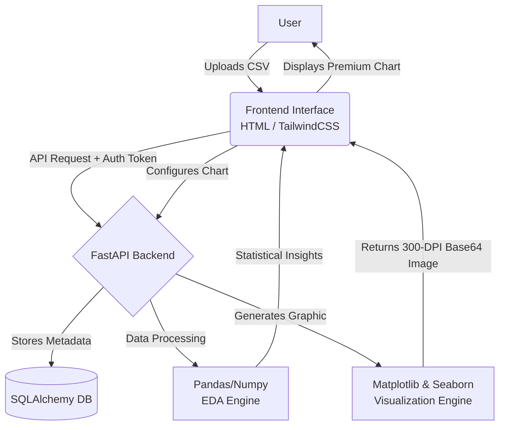

# 📊 Dataset Analyzer

<div align="center">
  <h3>Automated Exploratory Data Analysis & Premium Visualization Builder</h3>
  <p>Say goodbye to writing redundant Python scripts for data analysis. Upload your dataset and extract insights instantly with a single click.</p>
</div>

---

## 😫 The Pain Point

Analyzing datasets is often **time-consuming, hectic, and repetitive**. 
- ⏳ **Redundant Code:** Data Scientists and Analysts waste countless hours rewriting boilerplate code for Pandas, Matplotlib, and Seaborn for every new dataset.
- 📉 **Accessibility Barrier:** Non-technical users, business analysts, or students struggle to extract meaningful statistical insights without knowing Python.
- 🤯 **Messy Visuals:** Producing clean, high-DPI, and presentation-ready charts from raw datasets often requires manual tweaking of axes, labels, and colors.
- 🔄 **Fragmented Workflow:** Switching between notebooks, scripts, and BI tools breaks the flow of exploratory data analysis (EDA).

---

## 💡 The Solution

**Dataset Analyzer** is a comprehensive, web-based platform that automates the entire EDA and visualization process. 
- 🚀 **Zero-Code Insights:** Upload any CSV file to instantly generate statistical summaries, correlation matrices, and missing value reports.
- 🎨 **Premium Visualization Builder:** A dynamic, sidebar-driven interface to build Bar, Line, Scatter, Histogram, Boxplot, and Pie charts directly from your web browser.
- 🧠 **Smart Engine:** The backend automatically handles high-cardinality data by capping categories, rotating overlapping labels, and rendering in gorgeous 300-DPI resolution.
- ✨ **Modern Glassmorphism UI:** A sleek, user-friendly interface built with TailwindCSS that makes data analysis feel like a premium experience.

---

## 🏗️ Folder Structure

The project is divided into two primary environments:

### `backend/` Folder (FastAPI Application)
Handles all data processing, authentication, and the visualization engine.
- **`app/api/`**: API endpoints (Auth, Upload, EDA, Visualization).
- **`app/models/`**: SQLAlchemy Database models (Users, Datasets).
- **`app/schemas/`**: Pydantic validation schemas.
- **`app/services/`**: Core business logic (Features the `visualization_engine.py` for Matplotlib/Seaborn).
- **`requirements.txt`**: Python dependencies (Matplotlib, Seaborn, Pandas, etc.).

### `frontend/` Folder (User Interface)
The client-facing application built with HTML, CSS, and Tailwind.
- **`index.html`**: Premium Landing Page.
- **`login.html` & `signup.html`**: User Authentication Interfaces.
- **`upload_dataset.html`**: File Upload Dashboard.
- **`Overview_EDA.html`**: Statistical Summary & Taxonomy Dashboard.
- **`Visualization.html`**: Dynamic Premium Chart Builder.

---

## ⚙️ How It Works (Architecture)



---

## 🛠️ Tech Stack & Technical Details

### Frontend 💻
- **React 18.3 with TypeScript**: Modern, component-based UI framework with type safety.
- **Vite 6**: Lightning-fast build tool for optimized production bundles.
- **TailwindCSS 4**: Utility-first CSS framework for responsive, premium design.
- **Framer Motion**: Advanced animations and interactive elements.
- **React Router 7**: Client-side routing for seamless navigation.
- **Lucide React**: Beautiful, customizable SVG icons.
- **Figma Components**: Professional, designer-approved UI components.

### Backend 🗄️
- **Python 3.11**: Core programming language.
- **FastAPI**: High-performance, asynchronous web framework for building APIs.
- **SQLAlchemy & SQLite**: ORM and database for managing user sessions and metadata.
- **Pydantic**: For rigorous data validation and schema definitions.
- **JWT (JSON Web Tokens)**: Secure, stateless user authentication.

### Data & Visualization Engine 📊
- **Pandas & Numpy**: For data manipulation, NaN handling, and statistical computations.
- **Matplotlib & Seaborn**: Server-side rendering engine modified to run in non-interactive mode (`Agg`). Configured with custom themes (`white` style with `muted` and `viridis` palettes) to produce high-fidelity, presentation-ready PNGs encoded in Base64 format.

---

## 🌟 Key Features
- **Automated Data Taxonomy:** Instantly categorizes columns into numerical, categorical, or datetime types.
- **Correlation Matrix:** Quickly identifies strongly correlated variables.
- **Smart Axis Handling:** Automatically rotates and truncates long category names to prevent chart overlapping.
- **Data Capping:** Groups dense, long-tail categorical data into "Others" to maintain visual clarity.
- **Secure Sessions:** Fully authenticated workflow ensuring user data privacy.
- **Export Ready:** Download high-resolution PNG charts directly from the dashboard.
- **Premium Landing Page:** Beautiful, interactive Figma-designed landing page with smooth animations.
- **Responsive Design:** Works seamlessly on desktop, tablet, and mobile devices.

---

## 🚀 Quick Start

### Prerequisites
- **Node.js 18+** (for frontend)
- **Python 3.11+** (for backend)
- **pip** (Python package manager)
- **npm** or **yarn** (Node package manager)

### Automated Setup (Recommended)

#### Windows:
```bash
./setup.bat
./dev-start.bat
```

#### macOS/Linux:
```bash
chmod +x setup.sh dev-start.sh
./setup.sh
./dev-start.sh
```

### Manual Setup

#### 1. Backend Setup
```bash
cd backend
python -m venv .venv
source .venv/bin/activate  # On Windows: .venv\Scripts\activate
pip install -r requirements.txt
python -m uvicorn app.main:app --reload
```

#### 2. Frontend Setup (Development)
```bash
cd frontend
npm install
npm run dev
```

#### 3. Build for Production
```bash
cd frontend
npm run build
cd ../backend
python -m uvicorn app.main:app --host 0.0.0.0 --port 8000
```

### Access the Application
- **Development Frontend:** http://localhost:5173
- **Development Backend/API:** http://localhost:8000
- **Production App:** http://localhost:8000

---

## 📋 Project Structure (New Frontend)

```
frontend/
├── src/
│   ├── main.tsx                    # React entry point
│   ├── App.tsx                     # Main router
│   ├── components/
│   │   ├── LandingPage.tsx        # Figma-designed landing page
│   │   ├── CustomCursor.tsx       # Interactive cursor
│   │   ├── InteractiveBackground.tsx  # Animated background
│   │   ├── FloatingElement.tsx    # Floating icons
│   │   └── Marquee.tsx            # Scrolling text animation
│   ├── hooks/
│   │   └── useSmoothMouse.ts      # Mouse tracking
│   ├── styles/
│   │   └── index.css              # Global styles
│   └── pages/ (Static HTML)
│       ├── login.html
│       ├── signup.html
│       ├── upload_dataset.html
│       ├── Overview_EDA.html
│       └── Visualization.html
├── index.html                      # HTML entry point
├── package.json                    # Dependencies
├── vite.config.ts                 # Build config
├── tailwind.config.ts             # Tailwind config
└── tsconfig.json                  # TypeScript config
```

---

## 📚 Documentation

- **[Integration Guide](./INTEGRATION_GUIDE.md)** - Detailed integration and architecture documentation
- **[API Contracts](./docs/api_contracts.md)** - API endpoint specifications
- **[User Guide](./docs/user_guide.md)** - How to use the platform

---
